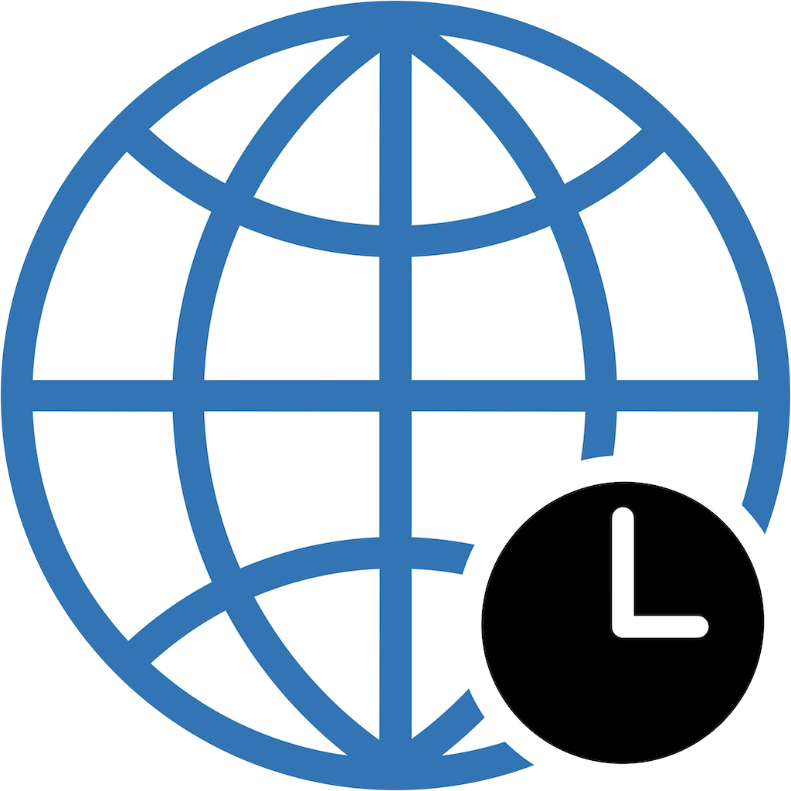

# IBM Cloud Test - Information page

Support documentation for the IBM Cloud Test iOS app.

## About

IBM Cloud Test is an iOS app that helps you test network latency to IBM Cloud datacenters worldwide. It helps to plan for optimal datacenter location for your cloud infrastructure based on real-time network performance.

## Download

[To be] Available on the Apple App Store:
- **App Name**: IBM Cloud Test
- **Category**: Utilities, Developer tools
- **Price**: Free
- **Requirements**: iPhone with iOS 17.0 or later

[Download on the App Store](#) *(link will be added after approval)*

## Features

### Core Functionality
- ✅ Test latency to 17 IBM Cloud datacenters worldwide (currently)
- ✅ Real-time, round-trip and non-cached network performance measurement
- ✅ Provides test results by datacenter location (city), region and zone type
- ✅ Sort results by datacenter location (city), region, or latency

### Export & Sharing
- ✅ Can export results as PDF reports
- ✅ Can export results data as CSV files
- ✅ Can email results directly from the app
- ✅ Can share results via iOS Share option
- ✅ Can print formatted reports

### User Interface
- ✅ Clean, modern SwiftUI design
- ✅ Interactive zone type information provided via button on the UI footer
- ✅ Test history tracking for min, max and average latency, with timestamps for the first and last test
- ✅ Professional layout and results reporting

## Datacenter Coverage

The app currently tests 17 IBM Cloud datacenters across the globe:

### Americas (6 datacenters)
- **United States**: Dallas, Washington DC, San Jose
- **Canada**: Toronto, Montreal
- **South America**: São Paulo

### Europe (5 datacenters)
- **Germany**: Frankfurt
- **United Kingdom**: London
- **Spain**: Madrid
- **France**: Paris
- **Netherlands**: Amsterdam

### Asia Pacific (6 datacenters)
- **Japan**: Tokyo, Osaka
- **Australia**: Sydney
- **India**: Mumbai, Chennai
- **Singapore**: Singapore

## How to Use

### Running a Test
1. Launch the app
2. Tap the **"Test"** button
3. Wait approx. 30 seconds for all datacenters to be tested
4. View results with latency values in milliseconds
5. Run the test again multiple times to get more reliable min, max and average latency values in reports

### Understanding Zone Types
Tap the blue **"Zone Types: MZR, SZR, CLA"** button at the bottom of UI to learn about:
- **MZR** (Multizone Region): High availability zones with VPC support
- **SZR** (Single-Campus Multizone Region): Campus-based zones
- **CLA** (Classic): Traditional datacenters

### Sorting Results
1. Tap the **"Sort"** button
2. Choose your preferred sorting:
   - **By Region**: Alphabetical by geographic region
   - **By Latency**: Fastest datacenters first
   - **By Name**: Alphabetical by datacenter name

### Exporting Results
1. Tap the **"Export"** button (available after running at least one test)
2. Choose your export method:
   - **Email**: Send PDF and CSV as email attachments
   - **Share**: Use iOS Share function to share PDF report using other apps, like Messaging
   - **Print**: Print formatted report directly (similar layout than the PDF report)

### Export Formats
- **PDF**: Professional formatted report with tables and metadata
- **CSV**: Aggregated data with min, max and average values for further analysis with spreadsheets
- **Filename format**: `IBM_Cloud_Test_YYYY-MM-DD_HHmm.pdf|csv`

## Privacy

**This app does not collect any personal information.**

- ✅ No logins
- ✅ No IBM Cloud account needed
- ✅ No user data collection
- ✅ No tracking or analytics
- ✅ No data is transmitted to third parties
- ✅ All tests are performed locally on your device
- ✅ All data is discarded when the app is closed

## Frequently Asked Questions

### Why do some tests fail?
Network connectivity issues or datacenter maintenance may cause test failures.  
This is normal behavior. Try testing again or check your internet connection.  
**Note:** There is 10 seconds (10 000 ms) latency timeout for each individual measurement. If the latency is longer than 10 seconds, it will be marked as failed.  

### How accurate are the results?
Results show network latency from your current location and may vary based on:
- Your internet connection speed
- Network congestion
- Geographic distance to datacenters
- Time of day

### Latency Measurement accuracy?
For more accurate/realistic latency measurements the app:  
- Uses HTTP HEAD requests to IBM Cloud Object Storage (COS) public s3-endpoints
- Measures full round-trip time including latencies for:
  - DNS resolution time
  - TCP connection establishment time
  - TLS handshake time
  - HTTP response time from target endpoint
  - Caching is disabled for accuracy
  - Has 10-second test timeout per endpoint

### Do I need an IBM Cloud account?
No! The app uses publicly accessible IBM Cloud Object Storage endpoints that don't require authentication or an IBM Cloud account.

### Can I test from anywhere in the world?
Yes! The app works from any location with internet connectivity. Results will vary based on your geographic location and network connectivity, as they should, to give you results that can be helpful in planning optimal service placement based on end-user's geographic location and network.

### How often should I run tests?
Network conditions change throughout the day. For best results:
- Run tests at different times of day
  - All results of test runs (max 100) will be retained in app memory and can be reported until the app is closed
- Test on both WiFi and cellular networks
  - Recommend to first export report and then close the app before testing from different network
- You should run tests and export results over different days to be able to compare them

### What do the colors mean?
Zone types are color-coded:
- **Blue**: MZR (Multizone Region with VPC)
- **Gray**: SZR (Single-Campus Multizone Region)
- **Gray**: CLA (Classic datacenter)

## Technical Details

### System Requirements
- **Platform**: iOS 17.0 or later
- **Devices**: iPhone (may work on iPad as well but this is not tested)
- **Network**: Internet connection required for testing
- **Storage**: Minimal (< 10 MB)

## Troubleshooting

### "Mail Not Available" Alert
**Problem**: Email export doesn't work  
**Solution**: 
- Configure a mail account in iOS Settings → Mail
- Or use the Share option for alternative export methods

### High Latency Values
**Problem**: All datacenters show high latency  
**Solution**:
- Check your internet connection
- Try different network (WiFi vs cellular)
- Remember: Geographic distance affects latency
- Test at different times of day
- Remember, 10 seconds (10 000 ms) is the timout limit for each individual test, until the test is marked as failed

### App Crashes or Freezes
**Problem**: App becomes unresponsive  
**Solution**:
- Force quit and restart the app
- Restart your device
- Ensure you have the latest iOS version
- Contact support if problem persists

### Test Takes Too Long
**Problem**: Testing seems stuck  
**Solution**:
- Each test run can take 30-60 seconds for all 17 datacenters
- Some datacenters may timeout (10 seconds timeouts for individual measurements)
- Check your internet connection
- If the test seems progressing, just be patient - the app is testing multiple locations

## Contact & Feedback

### Email Feedback (no support)
Contact for sending feedback: feedback@forumlab.fi

### Report a Bug
Should you notice a bug or other difficulty with the app, send feedback to the email address above.
Please include:
- iOS version
- Device model
- Description of the issue
- Steps to reproduce
- Screenshots (if applicable)

## Disclaimer

This is an unofficial, independent tool and is not affiliated with, endorsed by, or sponsored by IBM Corporation.  
The app uses publicly documented IBM Cloud Object Storage endpoints to measure network latency.  
All endpoint URLs are publicly available in IBM Cloud documentation.  
The app is provided for informational and testing purposes only.  

"IBM Cloud" is a trademark of International Business Machines Corporation, registered in many jurisdictions worldwide.  

## Version History

### Version 1.0.0 (Current)
- Initial release
- 17 IBM Cloud datacenters
- PDF and CSV export
- Email and iOS Share functionality
- Zone type information
- Test history tracking for min, max and average results aggregation

## Legal

**Copyright © 2026 Jukka Ruponen. All rights reserved.**

This app and its documentation are proprietary. The compiled application is distributed through the Apple App Store under the terms of the [Apple Developer Program License Agreement](https://developer.apple.com/support/terms/apple-developer-program-license-agreement) and [Apple's Standard License Agreement](http://www.apple.com/legal/itunes/appstore/dev/stdeula).

---

**App Version**: 1.0.0  
**Last Updated**: June 2026  
**Developer**: Jukka Ruponen  
**Feedback**: feedback@forumlab.fi
